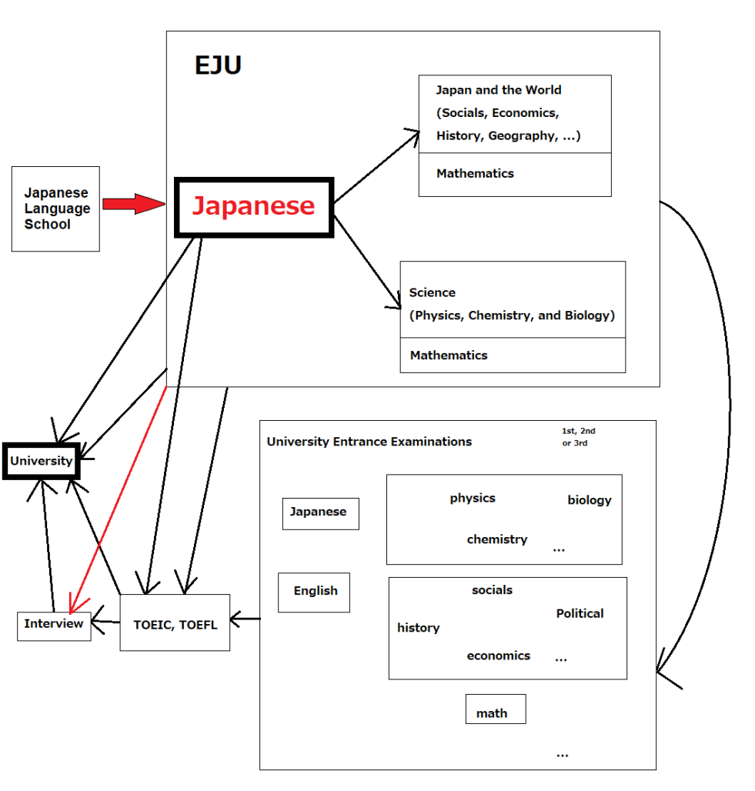

Hôm trước, có em hỏi mình phương pháp tìm trường đại học ở Nhật Bản:

* Ở Nhật nhiều ĐH quá, làm thế nào để vào được 1 trường ưng ý?  
* Làm thế nào để vào được trường tốt, trường nổi tiếng?  
* Làm sao để đỗ ĐH, cao học để không phải VỀ NƯỚC ? (từng bị hỏi, từng tự suy nghĩ)  
* Học, thi, nộp hồ sơ thế nào?  

-------------------

Có rất nhiều cách để vào được ĐH hoặc cao học Nhật Bản. 

1. Học bổng MEXT:  Học bổng của chính phủ Nhật Bản (khá là khó)
2. Nộp xét hồ sơ bằng tiếng Anh và vào học bằng tiếng Anh:  Có rất nhiều anh chị đều chọn học lên cao học bằng tiếng Anh (cũng không khó, cũng không dễ, bị giới hạn về trường vì một số trường không có chương trình đào tạo bằng tiếng Anh)
3. Tự túc, tự thi, tự đi phỏng vấn: Khá là gian nan và vất vả (Cũng không khó, cũng không dễ, không bị giới hạn về trường)
4. Đi theo tiến cử từ trường tiếng Nhật: Khá dễ nếu có điểm chuyên cần (出席率) tốt

Trước tiên, mình xin đề cập đến trang web: [JPSS](https://www.jpss.jp/)

JPSS là trang web mà các bạn có thể tìm và lựa chọn cho mình trường ĐH, CH có chuyên môn, nguyện vọng đúng ý của mình. Trang web có đầy đủ thông tin cả về ngày nộp hồ sơ, ngày tuyển, kì thi, … Tuy nhiên, vì trang web update thông tin có lúc hơi chậm, mình chỉ khuyên là nên dùng để tìm tên trường, ngành học phù hợp. Còn thời gian nộp hồ sơ hay học phí, học bổng, kì thi thì nên đến 進学フェア、オープンキャンパス, lên trang web trường hoặc trực tiếp đến staff của trường để tìm thông tin.

↓--------- 1 ---------↓

Học bổng MEXT khá là khó. Tuy nhiên nếu đi theo dạng này thì sẽ vào được rất nhiều trường có tiếng ở Nhật Bản (Thông Minh + Chăm Chỉ = Đỗ). Khá là ít bạn đi theo dạng đó nên mình sẽ không đề cập đến. Thông tin về học bổng này có rất nhiều trên Google. 

Các bạn có thể tham khảo thêm bài viết về [Một số điều về học bổng MEXT trường tiến cử](https://vinhhikari2712.wordpress.com/2018/12/27/con-duong-sang-nhat-bang-mext/) của bạn vinhhikari2712 nữa nhé.

↓--------- 2 ---------↓

Nộp và xét hồ sơ bằng tiếng Anh và vào học bằng tiếng Anh. Có rất nhiều các anh chị lựa chọn học theo dạng này. Bởi vì có anh chị tiếng Anh của họ tốt hơn tiếng Nhật. Họ tự tin về vốn ngoại ngữ của mình (có thể viết luận bằng tiếng Anh, phỏng vấn bằng tiếng Anh). Và khi vào học kì, họ có thể học và trau dồi kĩ năng cho bản thân bằng tiếng Anh. Và dĩ nhiên, tiếng Nhật họ học không phải chỉ để đó, mà dùng để giao tiếp trong cuộc sống hằng ngày, tìm bạn giao lưu.

↓--------- 3 ---------↓

Tự túc thi. Nếu đi theo hướng này thì mình thấy khá là gian nan. Tuy nhiên, “Có công mài sắt có ngày nên kim”. Nếu chịu khó trau dồi những kĩ năng (Quan trọng nhất là tiếng Nhật) khi đi thi từ ngày đầu tiên bước chân vào trường tiếng Nhật hay từ ngày bắt đầu học tiếng Nhật thì không có gì là không thể.

Bởi vì thi vào ĐH theo kiểu này, không chỉ học mỗi tiếng Nhật không thôi, mà còn phải học thêm cả môn tự nhiên (Toán, Lý, Hóa, …) hay môn Tổng hợp (Xã Hội, Kinh Tế, Lịch Sử, Địa Lý, …) bằng tiếng Nhật. Thực ra, khi thi EJU có cả đề tiếng Anh, nhưng khi thi các kì thi riêng của trường ĐH, thì một số trường chỉ ra đề bằng tiếng Nhật. Rồi bạn phải học cả Tiếng Anh để thi lấy chứng chỉ. Ban mỹ thuật thì chỉ thi mỗi tiếng Nhật EJU + thi kĩ năng cho trường tổ chức + phỏng vấn.

     

Nhìn vào sơ đồ trên cũng đủ hiểu rằng thi kiểu này vất vả đến nhường nào

Thi xong EJU là đến công đoạn tìm trường. Có trường Dân lập thường tuyển sớm nhất vào tháng 7, khi có kết quả EJU tháng 6 sau 3-4 ngày. Còn trường Quốc lập thường tuyển vào tầm tháng 2, tháng 3. Trước tiên, phải đặt ra cho mình 3 trường theo thứ tự từ trên xuống:

1. Trường khó, trường yêu thích, trường mà mình mơ ước phải thi vào được (KHÓ)
2. Trường tầm trung, vừa phải, tốt, trượt nguyện vọng 1 thì vào trường này (KHÔNG KHÓ CŨNG KHÔNG DỄ)
3. Trường dễ, khi trượt 2 nguyện vọng trên thì có trường này để không bị về nước.

Tìm hiểu ý kiến của các Sempai, bất kể Sempai quốc tịch nào cũng được. Tra trên JPSS, hoặc vào trường có tiếng như MARCH, 5S, STARS, 日東駒専… (theo kiểu này hơi nguy hiểm). Tham gia các hoạt động 進学フェア、Open Campus. Hồi trước mình hay tra trang này, sẵn giới thiệu luôn: [Trang này](https://manabi.benesse.ne.jp/) (hay cập nhật thông tin mới) và [Trang này](https://www.toshin-hensachi.com/) (phân chia rõ ràng rank của các ngành học). Có một phương án ổn nhất mà mình thấy là nên hỏi thầy cô trong trường tiếng, những thầy cô biết được sức học của mình và tìm một ngôi trường nào không cần nổi tiếng, chỉ cần chất lượng đào tạo tốt, sau này ra dễ xin được việc là ổn nhất. Bởi vì có rất nhiều học sinh họ thi vào những trường nổi tiếng, thậm chí số lượng thí sinh dự thi vượt quá hơn 1000 người, mà trường chỉ lấy 60-80 học sinh. Để vào được đó thì phải trải qua rất nhiều kì thi, thậm chí phải thi 2 đợt thi của trường tổ chức. Gian nan phải không nào?

Sau khi xác định được tên trường, bạn phải ghi chép lại ngày thi, môn thi, lên kế hoạch luyện tập ôn thi, phỏng vấn, xác định lệ phí thi (Quốc lập 20k, Dân lập 30k), lên kế hoạch đi lại phỏng vấn (mình từng gặp một bạn đã đăng kí thi 15 trường nổi tiếng trải dài từ đầu Nhật Bản đến cuối Nhật Bản (Phí thi + Tiền di chuyển), phải đến trường trực tiếp khi trường đó tổ chức phỏng vấn hoặc kì thi riêng của trường, vừa vất vả, lại mất thời gian). Xếp thứ tự trường theo nguyện vọng từ trên xuống dưới. Hoặc xếp theo thứ tự thời gian tổ chức thi, phỏng vấn.

↓--------- 4 ---------↓

Đi theo sự tiến cử của trường tiếng Nhật. Đây là cách vào một trường ĐH ở Nhật Bản không vất vả lắm. Chỉ cần đi học đầy đủ ở trường tiếng cộng với thành tích học tập tốt là đủ điều kiện để đi theo dạng này. Tuy nhiên, nhược điểm của dạng này là chỉ được đăng kí vào trường được tiến cử, không được thi vào các trường khác. Khi đã xác định được ngành mình học, yêu thích về ngành của mình học, mà trường ĐH đó có cho tiến cử thì không phải đây là sự lựa chọn an toàn nhất hay chăng? Đặc biệt, khả năng đỗ được vào trường ĐH là rất cao.

Đó là tất cả những gì mình biết được và chia sẻ lên đây. Cao học, Đại học, hay trường chuyên môn đều có thể áp dụng được 4 cách ở trên. Chúc các bạn tìm được cho mình sự lựa chọn tốt nhất.
